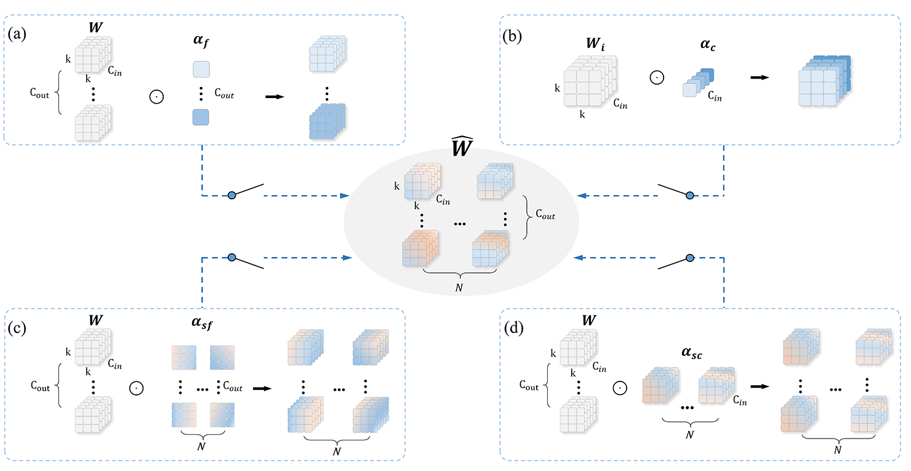
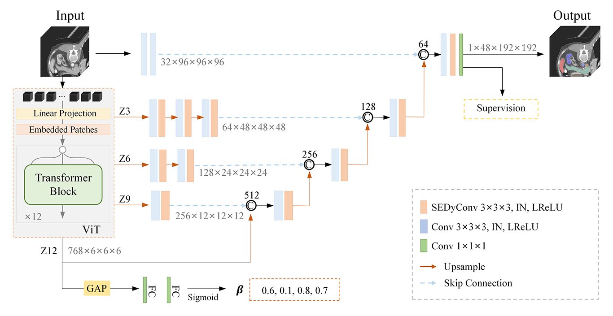

# SEDyConv

This repo holds code for SEDyConv: Spatially Enhanced Multi-dimensional Dynamic Convolution for Medical Multi-organ Segmentation in CTs

## 📌 What is This Paper About?

Automated multi-organ segmentation presents a considerable challenge owing to the diversity of organs and individual variations. Current state-of-the-art deep-learning techniques rely primarily on static kernel weights that are fixed after training, thereby limiting their flexibility in adapting to diverse inputs. In this study, we propose a novel multi-organ segmentation method using a plug-and-play three-dimensional dynamic convolution module. This method is designed to address the challenges posed by the variability of CT scans in contrast to static segmentation models. We uniquely leverage multiple input-dependent attention mechanisms to adjust the coefficients across four dimensions of convolutional kernels dynamically, offering enhanced adaptability. This approach surpasses traditional feature-based dynamic methods in terms of flexibility, which is attributable to the global sharing of kernel parameters and a smaller kernel shape. In addition, we utilize a refined local block to preserve the spatial properties and extend the convolutional kernel space to N dimensions, thereby efficiently enhancing the representational capabilities of the model through higher-dimensional feature fusion. Furthermore, we design dynamic switches to integrate multi-dimensional global and local information adaptively, guiding the model to generate feature maps that closely align with the input characteristics. Visualizations of the dynamic coefficients and features generated by different inputs clearly demonstrate the adaptability of our method. Extensive experiments on four multi-organ segmentation datasets with various labeled organs and scales indicate that our proposed method outperforms other state-of-the-art methods in terms of improving the segmentation accuracy, particularly for organs with complex morphologies or small sizes.

## *Keywords*

3D dynamic convolution; Attention mechanism; Medical image segmentation; Multi-organ segmentation

## Method

#### **Fig. 1.** Schematic of the convolution space on which our spatially enhanced multi-dimensional dynamic convolution (SEDyConv) operates. For clarity, consider the 2D convolution kernel and ignore the bias. (a) The output channel dimension; that is, the number of filter dimensions,(b) the input channel dimension,(c) the 2D spatial dimension of all filters, and (d) the 3D kernel space dimension of one filter. We first compute four type weights ${\alpha}_f$, ${\alpha}_c$, ${\alpha}_{sf}$ and ${\alpha}_{sc}$ for the original kernel ${W}$. Then, we dynamically combine the processed  with switches to generate the final $\hat{W}$. During this process, weights ${\alpha}_{sf}$ and ${\alpha}_{sc}$ are used to preserve the spatial properties and expand the convolutional kernel space into N dimensions.

#### **Fig. 2.** Structure of the lightweight SEDyConv module. This figure depicts a 2D dynamic convolution process. SEDyConv computes a weighted convolution kernel $\hat{W}$ from the input feature map $x$ through both a global and local path. Subsequently, the convolutional kernel $\hat{W}$ is utilized to obtain the corresponding output feature map $y$.

## Architecture of multi-organ segmentation networks with SEDyConv

#### **Fig. 3.** General architecture of multi-organ segmentation networks embedded with our dynamic convolutional module SEDyConv, covering CNN and ViT backbones. We also provide detailed implementations of two specific networks: SEDy-nnUNet, based on nnU-Net [7] with a pure CNN structure, and SEDy-Unetr, based on UNETR [25] with a hybrid CNN-Transformer structure.

We design a universal framework for 3D dynamic convolutional networks for multi-organ segmentation. As shown in Fig. 3, by replacing the static convolution layer with our 3D SEDyConv layer, the network maintains the original segmentation network structure while possessing dynamic properties.

To achieve an optimal trade-off between model precision and computational complexity, we replace approximately 50% of the static convolutional blocks. Note that this specific value is based on the coefficient of 0.5. Specifically, we replace all second convolutional blocks in each layer with SEDyConv, excluding the initial layer. The primary layer of the deep-learning network focuses on extracting basic low-level features such as edges, lines, and corners, thus retaining the original details of the inputs. Consequently, the structure of the first layer remains unchanged.

The architecture comprises four components: an encoder, a switch parameter generator, a jump connection, and a decoder.

The encoding path undergoes a downsampling process through multiple layers. The initial layer incorporates two static convolutional blocks, followed by four stages with dynamic SEDyConv layers. In a purely convolutional structure, each stage contains a standard static convolution block for downsampling and a dynamic convolutional block. In a ViT structure, each stage comprises three transform blocks and several 3D SEDyConv layers. The secondary convolutional block in each layer of the segmentation network is employed to produce adaptive feature maps and iteratively refine the pixel-level segmentation outcomes along the decoding pathway.

Following the bottom layer, a multi-dimensional switching component with a GAP operation and two FC layers is introduced to compute the dynamic parameter ${\beta}$. This component is exclusively used to control the switches of SEDyConv in the decoding path. Applying this mechanism solely to the decoding path reduces the complexity of the model and allows the high-level semantics to exert a more favorable impact on the output.

The dashed line in Fig. 3 denotes the concatenation of the upsampled feature map from the decoder with the corresponding feature map from the encoder, thereby preventing the loss of detailed information. The decoding path involves an upsampling process consisting of a 3D SEDyConv layer. The final layer of the network employs a 1×1×1 convolution to map the feature maps to the final segmentation output.

## Details of SEDy-nnUNet and SEDy-Unetr

We implemented our experiments based on the [nnU-Net](https://github.com/MIC-DKFZ/nnUNet) and [UNETR](https://monai.io/research/unetr) frameworks on the open-source [PyTorch platform](http://pytorch.org/). Both nnU-Net and UNETR are classical 3D multi-organ segmentation frameworks, one based on a pure CNN structure and the other based on the ViT architecture.

All models were trained from scratch on an NVIDIA 3090 24G GPU. To enhance the efficiency of the training process, we employed the temperature annealing strategy proposed in DyConv [13] for both frameworks.

## SEDy-nnUNet

#### **Fig. 4.** Architecture of SEDy-nnUNet for medical 3D CT images.

nnUNet is a segmentation network with a pure CNN architecture. The trained model relies on fixed convolutional kernel parameters, where each convolutional kernel extracts specific features from a given input. These fixed parameters imply that the convolutional kernels lack adaptability because they can not adjust to variations in the input data. By incorporating SEDyConv modules into the CNN layers, the model can dynamically adjust the output of each layer according to the input, thereby addressing important heterogeneities and potentially improving the final prediction results.

Based on the general architecture of the multi-organ segmentation networks illustrated in Fig. 3, we developed a specific network named SEDy-nnUNet, which is detailed in Fig. 4. The initial layer incorporates two 1×3×3 static convolutional blocks, followed by four layers that include a standard 3×3×3 static convolution and a 3×3×3 dynamic convolutional block. The bottleneck layer comprises two dynamic convolutional blocks. Each convolutional block is equipped with instance normalization and a ReLU. Following the bottleneck layer, a generator computes parameter  for a dynamic switch. SEDy-nnUNet employs a deeply supervised approach [61] to expedite network convergence and generates four distinct output sizes during training.

As a trade-off between the runtime and reward, the models of SEDy-nnUNet were trained for 500 epochs, where one epoch was defined as an iteration over 125 mini-batches. We used the original stochastic gradient descent [62] optimizer with an initial learning rate of 1e-2, weight decay of 3e-5 and Nesterov momentum with µ = 0.99. The epochs and initial temperature for the temperature annealing strategy were set to 30 and 30, respectively.

## SEDy-Unetr

#### **Fig. 5.** Architecture of SEDy-Unetr for medical 3D CT images.

As illustrated in Fig. 5, the input 3D volume is initially divided into a one-dimensional sequence with flattened patches. These patches are then projected onto a 768-dimensional embedding space through a linear layer. Additionally, a 768×216 learnable positional embedding is incorporated, and the resulting output is directed into Transformer blocks that encompass multi-head self-attention (MSA) and multi-layer perceptron (MLP) sublayers [63]. Four feature map representations $Z_l(l{\in}{3,6,9,12})$ are extracted from the Transformer blocks and reshaped into tensors of a consistent size 768×6×6×6. The output of the final layer $Z_12$ undergoes upsampling via a deconvolutional layer by a factor of two and is concatenated with the feature map of the preceding layer. In parallel, $Z_12$ is used to generate the switch parameter ${\beta}$. Following a structure similar to that of SEDy-nnUNet, the decoding path of SEDy-Unetr comprises successive dynamic convolutional layers. This connection process is iterated for all subsequent layers up to the original input resolution.

The SEDy-Unetr models were trained for 2500 epochs. Every 20 epochs, the model loss and accuracy were inferred from the validation set to select the best model. During training, we employed a linear warm-up and cosine annealing learning rate scheduler for 30 warm-up epochs. We also used the AdamW optimizer [64] with an initial learning rate of 1e-4 and weight decay of 1e-5. The temperature epochs and initial temperature for the temperature annealing strategy were set to 150 and 30, respectively. During the inference process, the sliding window approach was applied with an overlap of 0.5 to complete the segmentation of a CT case.
